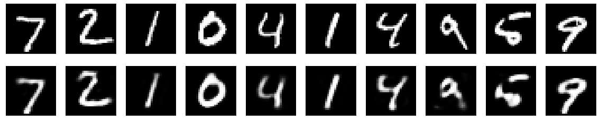
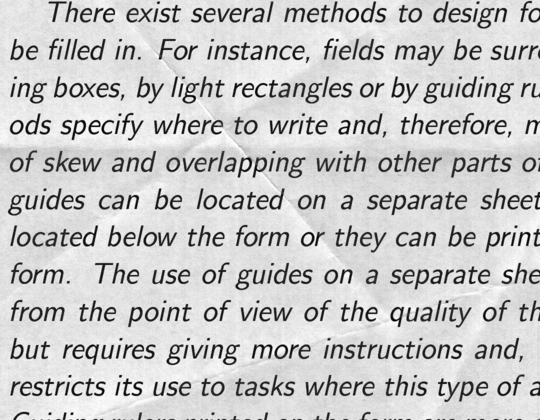
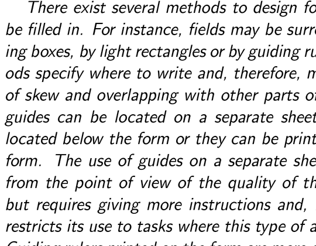
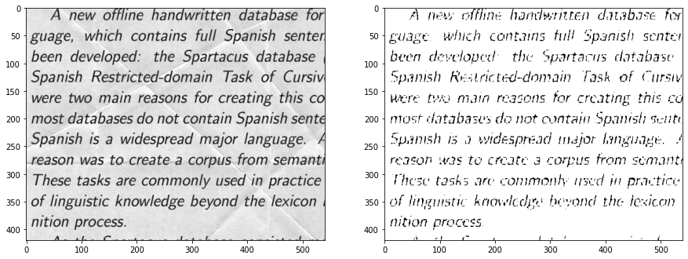

### What are autoencoders?

"Autoencoding" is a data compression algorithm where the compression and decompression functions are 

1.   data-specific
2.   lossy
3.   learned automatically from examples rather than engineered by a human.

## compression and decompression units are made up of neural networks.

### data-specific

- Autoencoders are data-specific, which means that they will only be able to 
compress data similar to what they have been trained on. This is different from, say, the MPEG-2 Audio Layer III (MP3) compression algorithm, which only holds assumptions about "sound" in general, but not about specific types of sounds. An autoencoder trained on pictures of faces would do a rather poor job of compressing pictures of trees, because the features it would learn would be face-specific.


### lossy
- Autoencoders are lossy, which means that the decompressed outputs will be degraded compared to the original inputs (similar to MP3 or JPEG compression). This differs from lossless arithmetic compression.

### They learn from data not an human enginnered algorithm.

- Autoencoders are learned automatically from data examples, which is a useful property: it means that it is easy to train specialized instances of the algorithm that will perform well on a specific type of input. It doesn't require any new engineering, just appropriate training data.

### What are autoencoders good for?
--- 
They are rarely used in practical applications. In 2012 they briefly found an application in **greedy layer-wise pretraining** for deep convolutional neural 
networks [1], but this quickly fell out of fashion as we started realizing that better **random weight initialization** schemes were sufficient for training deep networks from scratch. In 2014, **batch normalization** [2] started allowing for even deeper networks, and from late 2015 we could train arbitrarily deep networks from scratch using **residual learning** [3].

Today two interesting practical applications of autoencoders are **data denoising** and **dimensionality reduction** for data visualization. With appropriate dimensionality and sparsity constraints, autoencoders can learn data projections that are more interesting than PCA or other basic techniques.

For 2D visualization specifically, t-SNE (pronounced "tee-snee") is probably the best algorithm around, but it typically requires relatively low-dimensional data. So a good strategy for visualizing similarity relationships in high-dimensional data is to start by using an autoencoder to compress your data into a low-dimensional space (e.g. 32 dimensional), then use t-SNE for mapping the compressed data to a 2D plane. Note that a nice parametric implementation of t-SNE in Keras was developed by Kyle McDonald and is available on Github. Otherwise scikit-learn also has a simple and practical implementation.


### Let's build an Autoencoder in keras


```
import tensorflow as tf
# this is the size of our encoded representations
encoding_dim = 32  # 32 floats -> compression of factor 24.5, assuming the input is 784 floats
model = tf.keras.models.Sequential()
model.add(tf.keras.layers.Dense(units = encoding_dim, activation='relu',input_shape=(784,)))
model.add(tf.keras.layers.Dense(units = 784, activation='sigmoid'))
```


```
model.summary()
```

    Model: "sequential_8"
    _________________________________________________________________
    Layer (type)                 Output Shape              Param #   
    =================================================================
    dense_10 (Dense)             (None, 32)                25120     
    _________________________________________________________________
    dense_11 (Dense)             (None, 784)               25872     
    =================================================================
    Total params: 50,992
    Trainable params: 50,992
    Non-trainable params: 0
    _________________________________________________________________
    


```
#First, we'll configure our model to use a per-pixel binary crossentropy loss, and the Adadelta optimizer:
model.compile(optimizer='adam', loss='binary_crossentropy')
```


```
(x_train, _), (x_test, _) = tf.keras.datasets.mnist.load_data()
```


```
import numpy as np
#pre-process the data
x_train = x_train.astype('float32') / 255.
x_test = x_test.astype('float32') / 255.
x_train = x_train.reshape((len(x_train), np.prod(x_train.shape[1:])))
x_test = x_test.reshape((len(x_test), np.prod(x_test.shape[1:])))
print(x_train.shape)
print(x_test.shape)
```

    (60000, 784)
    (10000, 784)
    


```
model.fit(x_train, x_train,       #Notice that ouput is same as input
                epochs=50,
                batch_size=256,
                shuffle=True,
                validation_data=(x_test, x_test))
```

    Epoch 1/50
    235/235 [==============================] - 2s 10ms/step - loss: 0.2694 - val_loss: 0.1875
    Epoch 2/50
    235/235 [==============================] - 2s 10ms/step - loss: 0.1695 - val_loss: 0.1534
    Epoch 3/50
    235/235 [==============================] - 2s 9ms/step - loss: 0.1445 - val_loss: 0.1339
    Epoch 4/50
    235/235 [==============================] - 2s 10ms/step - loss: 0.1287 - val_loss: 0.1211
    Epoch 5/50
    235/235 [==============================] - 2s 9ms/step - loss: 0.1180 - val_loss: 0.1123
    Epoch 6/50
    235/235 [==============================] - 2s 10ms/step - loss: 0.1107 - val_loss: 0.1062
    Epoch 7/50
    235/235 [==============================] - 2s 10ms/step - loss: 0.1056 - val_loss: 0.1020
    Epoch 8/50
    235/235 [==============================] - 2s 9ms/step - loss: 0.1019 - val_loss: 0.0990
    Epoch 9/50
    235/235 [==============================] - 2s 10ms/step - loss: 0.0992 - val_loss: 0.0967
    Epoch 10/50
    235/235 [==============================] - 2s 10ms/step - loss: 0.0974 - val_loss: 0.0951
    Epoch 11/50
    235/235 [==============================] - 2s 10ms/step - loss: 0.0961 - val_loss: 0.0941
    Epoch 12/50
    235/235 [==============================] - 2s 10ms/step - loss: 0.0953 - val_loss: 0.0935
    Epoch 13/50
    235/235 [==============================] - 2s 10ms/step - loss: 0.0947 - val_loss: 0.0930
    Epoch 14/50
    235/235 [==============================] - 2s 10ms/step - loss: 0.0944 - val_loss: 0.0926
    Epoch 15/50
    235/235 [==============================] - 2s 10ms/step - loss: 0.0941 - val_loss: 0.0925
    Epoch 16/50
    235/235 [==============================] - 2s 9ms/step - loss: 0.0939 - val_loss: 0.0923
    Epoch 17/50
    235/235 [==============================] - 2s 9ms/step - loss: 0.0937 - val_loss: 0.0922
    Epoch 18/50
    235/235 [==============================] - 2s 10ms/step - loss: 0.0936 - val_loss: 0.0921
    Epoch 19/50
    235/235 [==============================] - 2s 10ms/step - loss: 0.0935 - val_loss: 0.0919
    Epoch 20/50
    235/235 [==============================] - 2s 9ms/step - loss: 0.0934 - val_loss: 0.0920
    Epoch 21/50
    235/235 [==============================] - 2s 10ms/step - loss: 0.0933 - val_loss: 0.0918
    Epoch 22/50
    235/235 [==============================] - 2s 10ms/step - loss: 0.0933 - val_loss: 0.0917
    Epoch 23/50
    235/235 [==============================] - 2s 10ms/step - loss: 0.0932 - val_loss: 0.0917
    Epoch 24/50
    235/235 [==============================] - 2s 10ms/step - loss: 0.0932 - val_loss: 0.0917
    Epoch 25/50
    235/235 [==============================] - 2s 10ms/step - loss: 0.0931 - val_loss: 0.0916
    Epoch 26/50
    235/235 [==============================] - 2s 10ms/step - loss: 0.0931 - val_loss: 0.0916
    Epoch 27/50
    235/235 [==============================] - 2s 9ms/step - loss: 0.0930 - val_loss: 0.0916
    Epoch 28/50
    235/235 [==============================] - 2s 10ms/step - loss: 0.0930 - val_loss: 0.0915
    Epoch 29/50
    235/235 [==============================] - 2s 10ms/step - loss: 0.0930 - val_loss: 0.0915
    Epoch 30/50
    235/235 [==============================] - 2s 10ms/step - loss: 0.0929 - val_loss: 0.0915
    Epoch 31/50
    235/235 [==============================] - 2s 10ms/step - loss: 0.0929 - val_loss: 0.0916
    Epoch 32/50
    235/235 [==============================] - 2s 10ms/step - loss: 0.0929 - val_loss: 0.0914
    Epoch 33/50
    235/235 [==============================] - 2s 10ms/step - loss: 0.0929 - val_loss: 0.0915
    Epoch 34/50
    235/235 [==============================] - 2s 10ms/step - loss: 0.0928 - val_loss: 0.0914
    Epoch 35/50
    235/235 [==============================] - 2s 10ms/step - loss: 0.0928 - val_loss: 0.0914
    Epoch 36/50
    235/235 [==============================] - 2s 10ms/step - loss: 0.0928 - val_loss: 0.0913
    Epoch 37/50
    235/235 [==============================] - 2s 10ms/step - loss: 0.0928 - val_loss: 0.0914
    Epoch 38/50
    235/235 [==============================] - 2s 10ms/step - loss: 0.0928 - val_loss: 0.0914
    Epoch 39/50
    235/235 [==============================] - 2s 10ms/step - loss: 0.0927 - val_loss: 0.0913
    Epoch 40/50
    235/235 [==============================] - 2s 10ms/step - loss: 0.0927 - val_loss: 0.0913
    Epoch 41/50
    235/235 [==============================] - 2s 10ms/step - loss: 0.0927 - val_loss: 0.0913
    Epoch 42/50
    235/235 [==============================] - 2s 10ms/step - loss: 0.0927 - val_loss: 0.0913
    Epoch 43/50
    235/235 [==============================] - 2s 10ms/step - loss: 0.0927 - val_loss: 0.0913
    Epoch 44/50
    235/235 [==============================] - 2s 10ms/step - loss: 0.0927 - val_loss: 0.0912
    Epoch 45/50
    235/235 [==============================] - 2s 10ms/step - loss: 0.0927 - val_loss: 0.0912
    Epoch 46/50
    235/235 [==============================] - 2s 10ms/step - loss: 0.0926 - val_loss: 0.0912
    Epoch 47/50
    235/235 [==============================] - 2s 10ms/step - loss: 0.0926 - val_loss: 0.0912
    Epoch 48/50
    235/235 [==============================] - 2s 10ms/step - loss: 0.0926 - val_loss: 0.0912
    Epoch 49/50
    235/235 [==============================] - 2s 10ms/step - loss: 0.0926 - val_loss: 0.0912
    Epoch 50/50
    235/235 [==============================] - 2s 10ms/step - loss: 0.0926 - val_loss: 0.0913
    


    <tensorflow.python.keras.callbacks.History at 0x7f721894d4e0>


```
#Building Encoder 
Encoder = tf.keras.models.Sequential()
## add Input and compressed layer
Encoder.add(model.layers[0])
Encoder.summary()
Encoded_images = Encoder.predict(x_test)
Encoded_images.shape
```

    Model: "sequential_10"
    _________________________________________________________________
    Layer (type)                 Output Shape              Param #   
    =================================================================
    dense_10 (Dense)             (None, 32)                25120     
    =================================================================
    Total params: 25,120
    Trainable params: 25,120
    Non-trainable params: 0
    _________________________________________________________________
    


    (10000, 32)


```
#Building Decoder
Decoder = tf.keras.models.Sequential()
Decoder.add(tf.keras.layers.Input(shape = (encoding_dim,)))
Decoder.add(model.layers[1])
Decoder.summary()
Decoded_images = Decoder.predict(Encoded_images)
Decoded_images.shape
```

    Model: "sequential_16"
    _________________________________________________________________
    Layer (type)                 Output Shape              Param #   
    =================================================================
    dense_11 (Dense)             (None, 784)               25872     
    =================================================================
    Total params: 25,872
    Trainable params: 25,872
    Non-trainable params: 0
    _________________________________________________________________
    


    (10000, 784)


```
#Let's compare reconstructed images with actual images
import matplotlib.pyplot as plt
%matplotlib inline
n = 10  # how many digits we will display
plt.figure(figsize=(20, 4))
for i in range(n):
    # display original
    ax = plt.subplot(2, n, i + 1)
    plt.imshow(x_test[i].reshape(28, 28))
    plt.gray()
    ax.get_xaxis().set_visible(False)
    ax.get_yaxis().set_visible(False)

    # display reconstruction
    ax = plt.subplot(2, n, i + 1 + n)
    plt.imshow(Decoded_images[i].reshape(28, 28))
    plt.gray()
    ax.get_xaxis().set_visible(False)
    ax.get_yaxis().set_visible(False)
plt.show()
```





### Deep autoencoder


```
#Building the model
Deep_autoencoder = tf.keras.models.Sequential()
Deep_autoencoder.add(tf.keras.layers.Dense(units = 128 , activation='relu',input_shape=(784,)))
Deep_autoencoder.add(tf.keras.layers.Dense(units = 64 , activation='relu'))
Deep_autoencoder.add(tf.keras.layers.Dense(units = 32 , activation='relu'))
Deep_autoencoder.add(tf.keras.layers.Dense(units = 64 , activation='relu'))
Deep_autoencoder.add(tf.keras.layers.Dense(units = 128 , activation='relu'))
Deep_autoencoder.add(tf.keras.layers.Dense(units = 784 , activation='sigmoid'))

#compiling the model
Deep_autoencoder.compile(optimizer = 'Adam', loss= 'binary_crossentropy')

#model summary
Deep_autoencoder.summary()

Deep_autoencoder.fit(x_train,x_train,epochs = 50, batch_size = 256 ,shuffle=True,
                validation_data=(x_test, x_test))


```

    Model: "sequential_17"
    _________________________________________________________________
    Layer (type)                 Output Shape              Param #   
    =================================================================
    dense_12 (Dense)             (None, 128)               100480    
    _________________________________________________________________
    dense_13 (Dense)             (None, 64)                8256      
    _________________________________________________________________
    dense_14 (Dense)             (None, 32)                2080      
    _________________________________________________________________
    dense_15 (Dense)             (None, 64)                2112      
    _________________________________________________________________
    dense_16 (Dense)             (None, 128)               8320      
    _________________________________________________________________
    dense_17 (Dense)             (None, 784)               101136    
    =================================================================
    Total params: 222,384
    Trainable params: 222,384
    Non-trainable params: 0
    _________________________________________________________________
    Epoch 1/50
    235/235 [==============================] - 4s 16ms/step - loss: 0.2487 - val_loss: 0.1728
    Epoch 2/50
    235/235 [==============================] - 4s 15ms/step - loss: 0.1549 - val_loss: 0.1406
    Epoch 3/50
    235/235 [==============================] - 4s 15ms/step - loss: 0.1340 - val_loss: 0.1261
    Epoch 4/50
    235/235 [==============================] - 4s 15ms/step - loss: 0.1237 - val_loss: 0.1192
    Epoch 5/50
    235/235 [==============================] - 4s 15ms/step - loss: 0.1188 - val_loss: 0.1154
    Epoch 6/50
    235/235 [==============================] - 4s 16ms/step - loss: 0.1149 - val_loss: 0.1117
    Epoch 7/50
    235/235 [==============================] - 4s 15ms/step - loss: 0.1117 - val_loss: 0.1085
    Epoch 8/50
    235/235 [==============================] - 4s 15ms/step - loss: 0.1090 - val_loss: 0.1062
    Epoch 9/50
    235/235 [==============================] - 4s 15ms/step - loss: 0.1064 - val_loss: 0.1039
    Epoch 10/50
    235/235 [==============================] - 4s 15ms/step - loss: 0.1041 - val_loss: 0.1018
    Epoch 11/50
    235/235 [==============================] - 4s 16ms/step - loss: 0.1021 - val_loss: 0.0997
    Epoch 12/50
    235/235 [==============================] - 4s 16ms/step - loss: 0.1006 - val_loss: 0.0982
    Epoch 13/50
    235/235 [==============================] - 4s 15ms/step - loss: 0.0993 - val_loss: 0.0973
    Epoch 14/50
    235/235 [==============================] - 4s 15ms/step - loss: 0.0983 - val_loss: 0.0965
    Epoch 15/50
    235/235 [==============================] - 4s 16ms/step - loss: 0.0974 - val_loss: 0.0958
    Epoch 16/50
    235/235 [==============================] - 4s 15ms/step - loss: 0.0966 - val_loss: 0.0955
    Epoch 17/50
    235/235 [==============================] - 4s 16ms/step - loss: 0.0960 - val_loss: 0.0945
    Epoch 18/50
    235/235 [==============================] - 4s 16ms/step - loss: 0.0953 - val_loss: 0.0937
    Epoch 19/50
    235/235 [==============================] - 4s 16ms/step - loss: 0.0946 - val_loss: 0.0934
    Epoch 20/50
    235/235 [==============================] - 4s 15ms/step - loss: 0.0939 - val_loss: 0.0925
    Epoch 21/50
    235/235 [==============================] - 4s 15ms/step - loss: 0.0934 - val_loss: 0.0919
    Epoch 22/50
    235/235 [==============================] - 4s 16ms/step - loss: 0.0928 - val_loss: 0.0916
    Epoch 23/50
    235/235 [==============================] - 4s 16ms/step - loss: 0.0922 - val_loss: 0.0909
    Epoch 24/50
    235/235 [==============================] - 4s 16ms/step - loss: 0.0918 - val_loss: 0.0907
    Epoch 25/50
    235/235 [==============================] - 4s 16ms/step - loss: 0.0913 - val_loss: 0.0903
    Epoch 26/50
    235/235 [==============================] - 4s 16ms/step - loss: 0.0909 - val_loss: 0.0896
    Epoch 27/50
    235/235 [==============================] - 4s 16ms/step - loss: 0.0904 - val_loss: 0.0893
    Epoch 28/50
    235/235 [==============================] - 4s 16ms/step - loss: 0.0901 - val_loss: 0.0890
    Epoch 29/50
    235/235 [==============================] - 4s 16ms/step - loss: 0.0899 - val_loss: 0.0889
    Epoch 30/50
    235/235 [==============================] - 4s 15ms/step - loss: 0.0895 - val_loss: 0.0886
    Epoch 31/50
    235/235 [==============================] - 4s 16ms/step - loss: 0.0893 - val_loss: 0.0882
    Epoch 32/50
    235/235 [==============================] - 4s 16ms/step - loss: 0.0890 - val_loss: 0.0881
    Epoch 33/50
    235/235 [==============================] - 4s 15ms/step - loss: 0.0888 - val_loss: 0.0878
    Epoch 34/50
    235/235 [==============================] - 4s 15ms/step - loss: 0.0886 - val_loss: 0.0875
    Epoch 35/50
    235/235 [==============================] - 4s 16ms/step - loss: 0.0884 - val_loss: 0.0874
    Epoch 36/50
    235/235 [==============================] - 4s 15ms/step - loss: 0.0881 - val_loss: 0.0872
    Epoch 37/50
    235/235 [==============================] - 4s 15ms/step - loss: 0.0880 - val_loss: 0.0873
    Epoch 38/50
    235/235 [==============================] - 4s 16ms/step - loss: 0.0877 - val_loss: 0.0871
    Epoch 39/50
    235/235 [==============================] - 4s 16ms/step - loss: 0.0876 - val_loss: 0.0867
    Epoch 40/50
    235/235 [==============================] - 4s 16ms/step - loss: 0.0874 - val_loss: 0.0865
    Epoch 41/50
    235/235 [==============================] - 4s 16ms/step - loss: 0.0872 - val_loss: 0.0864
    Epoch 42/50
    235/235 [==============================] - 4s 15ms/step - loss: 0.0870 - val_loss: 0.0861
    Epoch 43/50
    235/235 [==============================] - 4s 16ms/step - loss: 0.0867 - val_loss: 0.0858
    Epoch 44/50
    235/235 [==============================] - 4s 15ms/step - loss: 0.0866 - val_loss: 0.0857
    Epoch 45/50
    235/235 [==============================] - 4s 16ms/step - loss: 0.0864 - val_loss: 0.0858
    Epoch 46/50
    235/235 [==============================] - 4s 16ms/step - loss: 0.0862 - val_loss: 0.0855
    Epoch 47/50
    235/235 [==============================] - 4s 16ms/step - loss: 0.0861 - val_loss: 0.0854
    Epoch 48/50
    235/235 [==============================] - 4s 16ms/step - loss: 0.0859 - val_loss: 0.0852
    Epoch 49/50
    235/235 [==============================] - 4s 16ms/step - loss: 0.0858 - val_loss: 0.0852
    Epoch 50/50
    235/235 [==============================] - 4s 15ms/step - loss: 0.0857 - val_loss: 0.0849
    


    <tensorflow.python.keras.callbacks.History at 0x7f7213b1fba8>


### Convolutional Autoencoder
- Since our inputs are images, it makes sense to use convolutional neural networks (convnets) as encoders and decoders. In practical settings, autoencoders applied to images are always convolutional autoencoders --they simply perform much better.

- Let's implement one. The encoder will consist in a stack of Conv2D and MaxPooling2D layers (max pooling being used for spatial down-sampling), while the decoder will consist in a stack of Conv2D and UpSampling2D layers.


```
import tensorflow as tf
#Building the model
conv_autoencoder = tf.keras.models.Sequential()
conv_autoencoder.add(tf.keras.layers.Conv2D(16,(2,2),activation = 'relu', padding= 'same', input_shape=(28,28,1)))
conv_autoencoder.add(tf.keras.layers.MaxPool2D((2,2),padding= 'same')) # 14
conv_autoencoder.add(tf.keras.layers.Conv2D(8,(2,2),activation = 'relu', padding= 'same'))
conv_autoencoder.add(tf.keras.layers.MaxPool2D((2,2),padding= 'same'))  #7

# at this point the representation is (7 ,7, 8) i.e. 128-dimensional
conv_autoencoder.add(tf.keras.layers.Conv2D(8,(2,2),activation = 'relu', padding= 'same'))
conv_autoencoder.add(tf.keras.layers.UpSampling2D((2,2)))
conv_autoencoder.add(tf.keras.layers.Conv2D(16,(2,2),activation = 'relu', padding= 'same'))
conv_autoencoder.add(tf.keras.layers.UpSampling2D((2,2)))
conv_autoencoder.add(tf.keras.layers.Conv2D(1,(2,2),activation = 'sigmoid', padding= 'same'))

#compiling the model
conv_autoencoder.compile(optimizer = 'Adam', loss = 'binary_crossentropy')
conv_autoencoder.summary()
```

    Model: "sequential_1"
    _________________________________________________________________
    Layer (type)                 Output Shape              Param #   
    =================================================================
    conv2d_5 (Conv2D)            (None, 28, 28, 16)        80        
    _________________________________________________________________
    max_pooling2d_2 (MaxPooling2 (None, 14, 14, 16)        0         
    _________________________________________________________________
    conv2d_6 (Conv2D)            (None, 14, 14, 8)         520       
    _________________________________________________________________
    max_pooling2d_3 (MaxPooling2 (None, 7, 7, 8)           0         
    _________________________________________________________________
    conv2d_7 (Conv2D)            (None, 7, 7, 8)           264       
    _________________________________________________________________
    up_sampling2d_2 (UpSampling2 (None, 14, 14, 8)         0         
    _________________________________________________________________
    conv2d_8 (Conv2D)            (None, 14, 14, 16)        528       
    _________________________________________________________________
    up_sampling2d_3 (UpSampling2 (None, 28, 28, 16)        0         
    _________________________________________________________________
    conv2d_9 (Conv2D)            (None, 28, 28, 1)         65        
    =================================================================
    Total params: 1,457
    Trainable params: 1,457
    Non-trainable params: 0
    _________________________________________________________________
    


```
import numpy as np
(x_train, _), (x_test, _) = tf.keras.datasets.mnist.load_data()
#pre-process the data
x_train = x_train.astype('float32') / 255.
x_test = x_test.astype('float32') / 255.
x_train = np.reshape(x_train, (len(x_train), 28, 28, 1)) 
x_test = np.reshape(x_test, (len(x_test), 28, 28, 1))
```

    Downloading data from https://storage.googleapis.com/tensorflow/tf-keras-datasets/mnist.npz
    11493376/11490434 [==============================] - 0s 0us/step
    


```
%load_ext tensorboard
logdir = '/content/logging'
tensorboard_callback = tf.keras.callbacks.TensorBoard(logdir, histogram_freq=1)
```

    The tensorboard extension is already loaded. To reload it, use:
      %reload_ext tensorboard
    


```
conv_autoencoder.fit(x_train, x_train,        #Tip : If loss doesn't change much check out your activation function and loss function
                    epochs=50,                       # for e.g If using binary cross entropy loss use sigmoid as activation function in last layer.
                    batch_size= 64,
                    shuffle=True,
                    validation_data=(x_test, x_test),
                    callbacks=[tensorboard_callback])
```

    Epoch 1/50
    938/938 [==============================] - 62s 66ms/step - loss: 0.1872 - val_loss: 0.1250
    Epoch 2/50
    938/938 [==============================] - 62s 66ms/step - loss: 0.1188 - val_loss: 0.1122
    Epoch 3/50
    938/938 [==============================] - 62s 66ms/step - loss: 0.1090 - val_loss: 0.1040
    Epoch 4/50
    938/938 [==============================] - 63s 67ms/step - loss: 0.1031 - val_loss: 0.1003
    Epoch 5/50
    938/938 [==============================] - 62s 66ms/step - loss: 0.1000 - val_loss: 0.0977
    Epoch 6/50
    938/938 [==============================] - 62s 66ms/step - loss: 0.0980 - val_loss: 0.0963
    Epoch 7/50
    938/938 [==============================] - 63s 67ms/step - loss: 0.0967 - val_loss: 0.0955
    Epoch 8/50
    938/938 [==============================] - 62s 66ms/step - loss: 0.0958 - val_loss: 0.0943
    Epoch 9/50
    938/938 [==============================] - 62s 66ms/step - loss: 0.0952 - val_loss: 0.0938
    Epoch 10/50
    938/938 [==============================] - 62s 66ms/step - loss: 0.0948 - val_loss: 0.0935
    Epoch 11/50
    938/938 [==============================] - 61s 65ms/step - loss: 0.0944 - val_loss: 0.0933
    Epoch 12/50
    938/938 [==============================] - 61s 65ms/step - loss: 0.0942 - val_loss: 0.0932
    Epoch 13/50
    938/938 [==============================] - 62s 66ms/step - loss: 0.0939 - val_loss: 0.0927
    Epoch 14/50
    938/938 [==============================] - 61s 65ms/step - loss: 0.0937 - val_loss: 0.0925
    Epoch 15/50
    938/938 [==============================] - 61s 65ms/step - loss: 0.0935 - val_loss: 0.0923
    Epoch 16/50
    938/938 [==============================] - 62s 66ms/step - loss: 0.0933 - val_loss: 0.0922
    Epoch 17/50
    938/938 [==============================] - 61s 65ms/step - loss: 0.0932 - val_loss: 0.0921
    Epoch 18/50
    938/938 [==============================] - 61s 65ms/step - loss: 0.0930 - val_loss: 0.0918
    Epoch 19/50
    938/938 [==============================] - 61s 65ms/step - loss: 0.0928 - val_loss: 0.0918
    Epoch 20/50
    938/938 [==============================] - 61s 65ms/step - loss: 0.0927 - val_loss: 0.0915
    Epoch 21/50
    938/938 [==============================] - 61s 65ms/step - loss: 0.0925 - val_loss: 0.0915
    Epoch 22/50
    938/938 [==============================] - 62s 66ms/step - loss: 0.0924 - val_loss: 0.0919
    Epoch 23/50
    938/938 [==============================] - 63s 67ms/step - loss: 0.0923 - val_loss: 0.0913
    Epoch 24/50
    938/938 [==============================] - 63s 67ms/step - loss: 0.0922 - val_loss: 0.0910
    Epoch 25/50
    938/938 [==============================] - 62s 66ms/step - loss: 0.0921 - val_loss: 0.0912
    Epoch 26/50
    938/938 [==============================] - 62s 66ms/step - loss: 0.0920 - val_loss: 0.0908
    Epoch 27/50
    938/938 [==============================] - 62s 66ms/step - loss: 0.0918 - val_loss: 0.0908
    Epoch 28/50
    938/938 [==============================] - 64s 68ms/step - loss: 0.0918 - val_loss: 0.0907
    Epoch 29/50
    938/938 [==============================] - 63s 68ms/step - loss: 0.0917 - val_loss: 0.0905
    Epoch 30/50
    938/938 [==============================] - 62s 66ms/step - loss: 0.0916 - val_loss: 0.0904
    Epoch 31/50
    938/938 [==============================] - 62s 66ms/step - loss: 0.0915 - val_loss: 0.0904
    Epoch 32/50
    938/938 [==============================] - 61s 65ms/step - loss: 0.0914 - val_loss: 0.0904
    Epoch 33/50
    938/938 [==============================] - 60s 64ms/step - loss: 0.0914 - val_loss: 0.0905
    Epoch 34/50
    938/938 [==============================] - 61s 65ms/step - loss: 0.0913 - val_loss: 0.0903
    Epoch 35/50
    938/938 [==============================] - 61s 65ms/step - loss: 0.0912 - val_loss: 0.0901
    Epoch 36/50
    938/938 [==============================] - 60s 64ms/step - loss: 0.0912 - val_loss: 0.0901
    Epoch 37/50
    938/938 [==============================] - 60s 64ms/step - loss: 0.0911 - val_loss: 0.0901
    Epoch 38/50
    938/938 [==============================] - 60s 64ms/step - loss: 0.0911 - val_loss: 0.0900
    Epoch 39/50
    938/938 [==============================] - 67s 71ms/step - loss: 0.0910 - val_loss: 0.0901
    Epoch 40/50
    938/938 [==============================] - 61s 65ms/step - loss: 0.0910 - val_loss: 0.0899
    Epoch 41/50
    938/938 [==============================] - 59s 63ms/step - loss: 0.0910 - val_loss: 0.0899
    Epoch 42/50
    938/938 [==============================] - 59s 63ms/step - loss: 0.0909 - val_loss: 0.0898
    Epoch 43/50
    938/938 [==============================] - 59s 63ms/step - loss: 0.0909 - val_loss: 0.0898
    Epoch 44/50
    938/938 [==============================] - 60s 64ms/step - loss: 0.0908 - val_loss: 0.0901
    Epoch 45/50
    938/938 [==============================] - 59s 63ms/step - loss: 0.0908 - val_loss: 0.0898
    Epoch 46/50
    938/938 [==============================] - 60s 64ms/step - loss: 0.0908 - val_loss: 0.0897
    Epoch 47/50
    938/938 [==============================] - 59s 63ms/step - loss: 0.0907 - val_loss: 0.0898
    Epoch 48/50
    938/938 [==============================] - 59s 63ms/step - loss: 0.0907 - val_loss: 0.0896
    Epoch 49/50
    938/938 [==============================] - 60s 64ms/step - loss: 0.0907 - val_loss: 0.0899
    Epoch 50/50
    938/938 [==============================] - 60s 64ms/step - loss: 0.0906 - val_loss: 0.0896
    


    <tensorflow.python.keras.callbacks.History at 0x7face98f1a58>


```
%tensorboard --logdir '/content/logging/'
```


    <IPython.core.display.Javascript object>


- The model converges to a loss of val_loss: 0.0896 
- Things that matter are the encoding dimension here it is (7,7,8) = 392 the lower this dimension gets the more the loss would be.


```
### Variational autoencoder (VAE)
```

### Variational autoencoder (VAE) 

- Variational autoencoders are a slightly more modern and interesting take on autoencoding.

- What is a variational autoencoder, you ask? It's a type of autoencoder with added constraints on the encoded representations being learned. More precisely, it is an autoencoder that learns a latent variable model for its input data. So instead of letting your neural network learn an arbitrary function, you are learning the parameters of a probability distribution modeling your data. If you sample points from this distribution, you can generate new input data samples: a VAE is a **"generative model"**.

- How does a variational autoencoder work?

  First, an encoder network turns the input samples x into two parameters in a latent space, which we will note z_mean and z_log_sigma. Then, we randomly sample similar points z from the latent normal distribution that is assumed to generate the data, via z = z_mean + exp(z_log_sigma) * epsilon, where epsilon is a random normal tensor. Finally, a decoder network maps these latent space points back to the original input data.

  The parameters of the model are trained via two loss functions: a reconstruction loss forcing the decoded samples to match the initial inputs (just like in our previous autoencoders), and the KL divergence between the learned latent distribution and the prior distribution, acting as a regularization term. You could actually get rid of this latter term entirely, although it does help in learning well-formed latent spaces and reducing overfitting to the training data.

- The code for VAE can be found here https://github.com/keras-team/keras/blob/master/examples/variational_autoencoder.py


```
## Application of Auto-encoders to de-noising

from google.colab import files
uploaded  = files.upload()
for fn in uploaded.keys():
  print('User uploaded file "{name}" with length {length} bytes'.format(
      name=fn, length=len(uploaded[fn])))

# Then move kaggle.json into the folder where the API expects to find it.
!mkdir -p ~/.kaggle/ && mv kaggle.json ~/.kaggle/ && chmod 600 ~/.kaggle/kaggle.json
```


<input type="file" id="files-8191ded8-0483-491d-a537-94e7ade13d2c" name="files[]" multiple disabled />
<output id="result-8191ded8-0483-491d-a537-94e7ade13d2c">
 Upload widget is only available when the cell has been executed in the
 current browser session. Please rerun this cell to enable.
 </output>
 <script src="/nbextensions/google.colab/files.js"></script> 


    Saving kaggle.json to kaggle.json
    User uploaded file "kaggle.json" with length 69 bytes
    


```

!kaggle competitions download -c denoising-dirty-documents
```

    Warning: Looks like you're using an outdated API Version, please consider updating (server 1.5.6 / client 1.5.4)
    Downloading sampleSubmission.csv.zip to /content
     78% 17.0M/21.9M [00:00<00:00, 15.6MB/s]
    100% 21.9M/21.9M [00:00<00:00, 26.5MB/s]
    Downloading train.zip to /content
     49% 9.00M/18.5M [00:01<00:01, 7.88MB/s]
    100% 18.5M/18.5M [00:01<00:00, 14.7MB/s]
    Downloading test.zip to /content
     96% 9.00M/9.39M [00:00<00:00, 9.12MB/s]
    100% 9.39M/9.39M [00:01<00:00, 9.69MB/s]
    Downloading train_cleaned.zip to /content
     79% 5.00M/6.30M [00:00<00:00, 8.23MB/s]
    100% 6.30M/6.30M [00:00<00:00, 9.88MB/s]
    


```
!unzip train.zip 
!unzip train_cleaned.zip
!unzip test.zip
```


```
from IPython.display import Image
Image("/content/train/101.png")
```





```
Image("/content/train_cleaned/101.png")
```





```
from PIL import Image
import numpy
im = Image.open("/content/train/101.png")
np_im = numpy.array(im)
print (np_im.shape)
```

    (420, 540)
    


```
#Let's build an conv-net autoencoder
import tensorflow as tf
#Building the model
conv_autoencoder = tf.keras.models.Sequential()

conv_autoencoder.add(tf.keras.layers.Conv2D(32,(2,2), input_shape = (420,540,1),activation = 'relu',padding = 'same'))
conv_autoencoder.add(tf.keras.layers.MaxPool2D((2,2),padding= 'same'))  # 210,270
conv_autoencoder.add(tf.keras.layers.Conv2D(64,(2,2),activation = 'relu', padding= 'same'))
conv_autoencoder.add(tf.keras.layers.MaxPool2D((2,2),padding= 'same'))  #105,135
conv_autoencoder.add(tf.keras.layers.Conv2D(64,(2,2),activation = 'relu', padding= 'same'))
conv_autoencoder.add(tf.keras.layers.UpSampling2D((2,2))) # 210,270
conv_autoencoder.add(tf.keras.layers.Conv2D(32,(2,2),activation = 'relu', padding= 'same'))
conv_autoencoder.add(tf.keras.layers.UpSampling2D((2,2))) #420,540
conv_autoencoder.add(tf.keras.layers.Conv2D(1,(2,2),activation = 'sigmoid', padding= 'same'))


conv_autoencoder.summary()
```

    Model: "sequential_2"
    _________________________________________________________________
    Layer (type)                 Output Shape              Param #   
    =================================================================
    conv2d_12 (Conv2D)           (None, 420, 540, 32)      160       
    _________________________________________________________________
    max_pooling2d_5 (MaxPooling2 (None, 210, 270, 32)      0         
    _________________________________________________________________
    conv2d_13 (Conv2D)           (None, 210, 270, 64)      8256      
    _________________________________________________________________
    max_pooling2d_6 (MaxPooling2 (None, 105, 135, 64)      0         
    _________________________________________________________________
    conv2d_14 (Conv2D)           (None, 105, 135, 64)      16448     
    _________________________________________________________________
    up_sampling2d_5 (UpSampling2 (None, 210, 270, 64)      0         
    _________________________________________________________________
    conv2d_15 (Conv2D)           (None, 210, 270, 32)      8224      
    _________________________________________________________________
    up_sampling2d_6 (UpSampling2 (None, 420, 540, 32)      0         
    _________________________________________________________________
    conv2d_16 (Conv2D)           (None, 420, 540, 1)       129       
    =================================================================
    Total params: 33,217
    Trainable params: 33,217
    Non-trainable params: 0
    _________________________________________________________________
    


```
#compiling the model
optimizer = tf.keras.optimizers.Adam(lr = 0.001)
conv_autoencoder.compile(optimizer = optimizer, loss = 'mse')
```


```
import os
from tensorflow.keras.preprocessing.image import load_img, array_to_img, img_to_array
import numpy as np

X = []
Y = []

train_images = os.listdir('/content/train/')
train_labels = os.listdir('/content/train_cleaned')\

for img in train_images:
    img = load_img('/content/train/'+img, color_mode = "grayscale",target_size=(420,540))
    img = img_to_array(img).astype('float32')/255.
    X.append(img)

for img in train_labels:
    img = load_img('/content/train_cleaned/'+ img, color_mode = "grayscale",target_size=(420,540))
    img = img_to_array(img).astype('float32')/255.
    Y.append(img)


X = np.array(X)
Y = np.array(Y)

print("Size of X : ", X.shape)
print("Size of Y : ", Y.shape)
```

    Size of X :  (144, 420, 540, 1)
    Size of Y :  (144, 420, 540, 1)
    


```
# Split the dataset into training and validation. Always set the random state!!
from sklearn.model_selection import train_test_split
X_train, X_valid, y_train, y_valid = train_test_split(X, Y, test_size=0.1, random_state=111)
print("Total number of training samples: ", X_train.shape)
print("Total number of validation samples: ", X_valid.shape)
```

    Total number of training samples:  (129, 420, 540, 1)
    Total number of validation samples:  (15, 420, 540, 1)
    


```
%load_ext tensorboard
logdir = '/content/logging'
tensorboard_callback = tf.keras.callbacks.TensorBoard(logdir, histogram_freq=1)
```

    The tensorboard extension is already loaded. To reload it, use:
      %reload_ext tensorboard
    


```
conv_autoencoder.fit(X_train, y_train, epochs=200, batch_size=20, validation_data=(X_valid, y_valid), callbacks = [tensorboard_callback])
```

    ERROR! Session/line number was not unique in database. History logging moved to new session 59
    Epoch 1/200
    7/7 [==============================] - 3s 429ms/step - loss: 0.1495 - val_loss: 0.0793
    Epoch 2/200
    7/7 [==============================] - 2s 219ms/step - loss: 0.0768 - val_loss: 0.0766
    Epoch 3/200
    7/7 [==============================] - 2s 219ms/step - loss: 0.0811 - val_loss: 0.0785
    Epoch 4/200
    7/7 [==============================] - 2s 220ms/step - loss: 0.0816 - val_loss: 0.0778
    Epoch 5/200
    7/7 [==============================] - 2s 219ms/step - loss: 0.0800 - val_loss: 0.0742
    Epoch 6/200
    7/7 [==============================] - 2s 219ms/step - loss: 0.0738 - val_loss: 0.0698
    Epoch 7/200
    7/7 [==============================] - 2s 222ms/step - loss: 0.0719 - val_loss: 0.0691
    Epoch 8/200
    7/7 [==============================] - 2s 221ms/step - loss: 0.0712 - val_loss: 0.0687
    Epoch 9/200
    7/7 [==============================] - 2s 220ms/step - loss: 0.0707 - val_loss: 0.0680
    Epoch 10/200
    7/7 [==============================] - 2s 223ms/step - loss: 0.0696 - val_loss: 0.0667
    Epoch 11/200
    7/7 [==============================] - 2s 222ms/step - loss: 0.0679 - val_loss: 0.0643
    Epoch 12/200
    7/7 [==============================] - 2s 225ms/step - loss: 0.0648 - val_loss: 0.0611
    Epoch 13/200
    7/7 [==============================] - 2s 226ms/step - loss: 0.0617 - val_loss: 0.0582
    Epoch 14/200
    7/7 [==============================] - 2s 225ms/step - loss: 0.0589 - val_loss: 0.0553
    Epoch 15/200
    7/7 [==============================] - 2s 224ms/step - loss: 0.0562 - val_loss: 0.0526
    Epoch 16/200
    7/7 [==============================] - 2s 222ms/step - loss: 0.0532 - val_loss: 0.0498
    Epoch 17/200
    7/7 [==============================] - 2s 224ms/step - loss: 0.0499 - val_loss: 0.0474
    Epoch 18/200
    7/7 [==============================] - 2s 223ms/step - loss: 0.0477 - val_loss: 0.0453
    Epoch 19/200
    7/7 [==============================] - 2s 223ms/step - loss: 0.0453 - val_loss: 0.0431
    Epoch 20/200
    7/7 [==============================] - 2s 221ms/step - loss: 0.0439 - val_loss: 0.0418
    Epoch 21/200
    7/7 [==============================] - 2s 224ms/step - loss: 0.0424 - val_loss: 0.0409
    Epoch 22/200
    7/7 [==============================] - 2s 221ms/step - loss: 0.0414 - val_loss: 0.0398
    Epoch 23/200
    7/7 [==============================] - 2s 220ms/step - loss: 0.0405 - val_loss: 0.0393
    Epoch 24/200
    7/7 [==============================] - 2s 222ms/step - loss: 0.0398 - val_loss: 0.0385
    Epoch 25/200
    7/7 [==============================] - 2s 223ms/step - loss: 0.0392 - val_loss: 0.0381
    Epoch 26/200
    7/7 [==============================] - 2s 221ms/step - loss: 0.0385 - val_loss: 0.0372
    Epoch 27/200
    7/7 [==============================] - 2s 218ms/step - loss: 0.0377 - val_loss: 0.0367
    Epoch 28/200
    7/7 [==============================] - 2s 219ms/step - loss: 0.0370 - val_loss: 0.0360
    Epoch 29/200
    7/7 [==============================] - 2s 220ms/step - loss: 0.0365 - val_loss: 0.0355
    Epoch 30/200
    7/7 [==============================] - 2s 221ms/step - loss: 0.0356 - val_loss: 0.0349
    Epoch 31/200
    7/7 [==============================] - 2s 220ms/step - loss: 0.0353 - val_loss: 0.0344
    Epoch 32/200
    7/7 [==============================] - 2s 220ms/step - loss: 0.0347 - val_loss: 0.0341
    Epoch 33/200
    7/7 [==============================] - 2s 220ms/step - loss: 0.0343 - val_loss: 0.0338
    Epoch 34/200
    7/7 [==============================] - 2s 218ms/step - loss: 0.0338 - val_loss: 0.0329
    Epoch 35/200
    7/7 [==============================] - 2s 220ms/step - loss: 0.0333 - val_loss: 0.0329
    Epoch 36/200
    7/7 [==============================] - 2s 221ms/step - loss: 0.0327 - val_loss: 0.0322
    Epoch 37/200
    7/7 [==============================] - 2s 220ms/step - loss: 0.0327 - val_loss: 0.0318
    Epoch 38/200
    7/7 [==============================] - 2s 219ms/step - loss: 0.0323 - val_loss: 0.0319
    Epoch 39/200
    7/7 [==============================] - 2s 219ms/step - loss: 0.0322 - val_loss: 0.0317
    Epoch 40/200
    7/7 [==============================] - 2s 218ms/step - loss: 0.0317 - val_loss: 0.0313
    Epoch 41/200
    7/7 [==============================] - 2s 218ms/step - loss: 0.0311 - val_loss: 0.0306
    Epoch 42/200
    7/7 [==============================] - 2s 219ms/step - loss: 0.0310 - val_loss: 0.0311
    Epoch 43/200
    7/7 [==============================] - 2s 221ms/step - loss: 0.0310 - val_loss: 0.0302
    Epoch 44/200
    7/7 [==============================] - 2s 219ms/step - loss: 0.0304 - val_loss: 0.0298
    Epoch 45/200
    7/7 [==============================] - 2s 219ms/step - loss: 0.0302 - val_loss: 0.0299
    Epoch 46/200
    7/7 [==============================] - 2s 220ms/step - loss: 0.0298 - val_loss: 0.0293
    Epoch 47/200
    7/7 [==============================] - 2s 222ms/step - loss: 0.0299 - val_loss: 0.0299
    Epoch 48/200
    7/7 [==============================] - 2s 221ms/step - loss: 0.0295 - val_loss: 0.0290
    Epoch 49/200
    7/7 [==============================] - 2s 219ms/step - loss: 0.0292 - val_loss: 0.0286
    Epoch 50/200
    7/7 [==============================] - 2s 221ms/step - loss: 0.0289 - val_loss: 0.0287
    Epoch 51/200
    7/7 [==============================] - 2s 221ms/step - loss: 0.0286 - val_loss: 0.0283
    Epoch 52/200
    7/7 [==============================] - 2s 222ms/step - loss: 0.0286 - val_loss: 0.0279
    Epoch 53/200
    7/7 [==============================] - 2s 220ms/step - loss: 0.0283 - val_loss: 0.0277
    Epoch 54/200
    7/7 [==============================] - 2s 223ms/step - loss: 0.0280 - val_loss: 0.0274
    Epoch 55/200
    7/7 [==============================] - 2s 223ms/step - loss: 0.0276 - val_loss: 0.0272
    Epoch 56/200
    7/7 [==============================] - 2s 222ms/step - loss: 0.0271 - val_loss: 0.0269
    Epoch 57/200
    7/7 [==============================] - 2s 223ms/step - loss: 0.0271 - val_loss: 0.0269
    Epoch 58/200
    7/7 [==============================] - 2s 224ms/step - loss: 0.0267 - val_loss: 0.0264
    Epoch 59/200
    7/7 [==============================] - 2s 224ms/step - loss: 0.0264 - val_loss: 0.0262
    Epoch 60/200
    7/7 [==============================] - 2s 222ms/step - loss: 0.0263 - val_loss: 0.0263
    Epoch 61/200
    7/7 [==============================] - 2s 225ms/step - loss: 0.0262 - val_loss: 0.0259
    Epoch 62/200
    7/7 [==============================] - 2s 221ms/step - loss: 0.0260 - val_loss: 0.0255
    Epoch 63/200
    7/7 [==============================] - 2s 223ms/step - loss: 0.0254 - val_loss: 0.0253
    Epoch 64/200
    7/7 [==============================] - 2s 223ms/step - loss: 0.0251 - val_loss: 0.0251
    Epoch 65/200
    7/7 [==============================] - 2s 222ms/step - loss: 0.0250 - val_loss: 0.0247
    Epoch 66/200
    7/7 [==============================] - 2s 223ms/step - loss: 0.0250 - val_loss: 0.0247
    Epoch 67/200
    7/7 [==============================] - 2s 221ms/step - loss: 0.0246 - val_loss: 0.0247
    Epoch 68/200
    7/7 [==============================] - 2s 221ms/step - loss: 0.0246 - val_loss: 0.0244
    Epoch 69/200
    7/7 [==============================] - 2s 222ms/step - loss: 0.0242 - val_loss: 0.0245
    Epoch 70/200
    7/7 [==============================] - 2s 222ms/step - loss: 0.0240 - val_loss: 0.0238
    Epoch 71/200
    7/7 [==============================] - 2s 226ms/step - loss: 0.0241 - val_loss: 0.0235
    Epoch 72/200
    7/7 [==============================] - 2s 222ms/step - loss: 0.0236 - val_loss: 0.0234
    Epoch 73/200
    7/7 [==============================] - 2s 222ms/step - loss: 0.0234 - val_loss: 0.0232
    Epoch 74/200
    7/7 [==============================] - 2s 222ms/step - loss: 0.0231 - val_loss: 0.0231
    Epoch 75/200
    7/7 [==============================] - 2s 221ms/step - loss: 0.0230 - val_loss: 0.0229
    Epoch 76/200
    7/7 [==============================] - 2s 222ms/step - loss: 0.0226 - val_loss: 0.0227
    Epoch 77/200
    7/7 [==============================] - 2s 222ms/step - loss: 0.0229 - val_loss: 0.0230
    Epoch 78/200
    7/7 [==============================] - 2s 221ms/step - loss: 0.0228 - val_loss: 0.0228
    Epoch 79/200
    7/7 [==============================] - 2s 221ms/step - loss: 0.0227 - val_loss: 0.0235
    Epoch 80/200
    7/7 [==============================] - 2s 224ms/step - loss: 0.0226 - val_loss: 0.0222
    Epoch 81/200
    7/7 [==============================] - 2s 224ms/step - loss: 0.0221 - val_loss: 0.0221
    Epoch 82/200
    7/7 [==============================] - 2s 221ms/step - loss: 0.0222 - val_loss: 0.0219
    Epoch 83/200
    7/7 [==============================] - 2s 221ms/step - loss: 0.0218 - val_loss: 0.0218
    Epoch 84/200
    7/7 [==============================] - 2s 221ms/step - loss: 0.0218 - val_loss: 0.0216
    Epoch 85/200
    7/7 [==============================] - 2s 223ms/step - loss: 0.0216 - val_loss: 0.0215
    Epoch 86/200
    7/7 [==============================] - 2s 220ms/step - loss: 0.0215 - val_loss: 0.0214
    Epoch 87/200
    7/7 [==============================] - 2s 222ms/step - loss: 0.0213 - val_loss: 0.0214
    Epoch 88/200
    7/7 [==============================] - 2s 219ms/step - loss: 0.0212 - val_loss: 0.0212
    Epoch 89/200
    7/7 [==============================] - 2s 223ms/step - loss: 0.0212 - val_loss: 0.0210
    Epoch 90/200
    7/7 [==============================] - 2s 223ms/step - loss: 0.0211 - val_loss: 0.0210
    Epoch 91/200
    7/7 [==============================] - 2s 221ms/step - loss: 0.0211 - val_loss: 0.0217
    Epoch 92/200
    7/7 [==============================] - 2s 222ms/step - loss: 0.0213 - val_loss: 0.0215
    Epoch 93/200
    7/7 [==============================] - 2s 222ms/step - loss: 0.0211 - val_loss: 0.0218
    Epoch 94/200
    7/7 [==============================] - 2s 223ms/step - loss: 0.0210 - val_loss: 0.0208
    Epoch 95/200
    7/7 [==============================] - 2s 221ms/step - loss: 0.0208 - val_loss: 0.0209
    Epoch 96/200
    7/7 [==============================] - 2s 222ms/step - loss: 0.0209 - val_loss: 0.0205
    Epoch 97/200
    7/7 [==============================] - 2s 221ms/step - loss: 0.0207 - val_loss: 0.0207
    Epoch 98/200
    7/7 [==============================] - 2s 221ms/step - loss: 0.0203 - val_loss: 0.0202
    Epoch 99/200
    7/7 [==============================] - 2s 224ms/step - loss: 0.0200 - val_loss: 0.0201
    Epoch 100/200
    7/7 [==============================] - 2s 220ms/step - loss: 0.0203 - val_loss: 0.0207
    Epoch 101/200
    7/7 [==============================] - 2s 221ms/step - loss: 0.0203 - val_loss: 0.0200
    Epoch 102/200
    7/7 [==============================] - 2s 221ms/step - loss: 0.0200 - val_loss: 0.0199
    Epoch 103/200
    7/7 [==============================] - 2s 222ms/step - loss: 0.0199 - val_loss: 0.0198
    Epoch 104/200
    7/7 [==============================] - 2s 222ms/step - loss: 0.0197 - val_loss: 0.0198
    Epoch 105/200
    7/7 [==============================] - 2s 221ms/step - loss: 0.0198 - val_loss: 0.0196
    Epoch 106/200
    7/7 [==============================] - 2s 222ms/step - loss: 0.0194 - val_loss: 0.0195
    Epoch 107/200
    7/7 [==============================] - 2s 224ms/step - loss: 0.0194 - val_loss: 0.0195
    Epoch 108/200
    7/7 [==============================] - 2s 224ms/step - loss: 0.0195 - val_loss: 0.0197
    Epoch 109/200
    7/7 [==============================] - 2s 222ms/step - loss: 0.0192 - val_loss: 0.0197
    Epoch 110/200
    7/7 [==============================] - 2s 223ms/step - loss: 0.0195 - val_loss: 0.0198
    Epoch 111/200
    7/7 [==============================] - 2s 222ms/step - loss: 0.0195 - val_loss: 0.0194
    Epoch 112/200
    7/7 [==============================] - 2s 224ms/step - loss: 0.0196 - val_loss: 0.0192
    Epoch 113/200
    7/7 [==============================] - 2s 222ms/step - loss: 0.0193 - val_loss: 0.0195
    Epoch 114/200
    7/7 [==============================] - 2s 222ms/step - loss: 0.0191 - val_loss: 0.0189
    Epoch 115/200
    7/7 [==============================] - 2s 221ms/step - loss: 0.0188 - val_loss: 0.0190
    Epoch 116/200
    7/7 [==============================] - 2s 220ms/step - loss: 0.0186 - val_loss: 0.0188
    Epoch 117/200
    7/7 [==============================] - 2s 223ms/step - loss: 0.0185 - val_loss: 0.0188
    Epoch 118/200
    7/7 [==============================] - 2s 223ms/step - loss: 0.0187 - val_loss: 0.0188
    Epoch 119/200
    7/7 [==============================] - 2s 220ms/step - loss: 0.0187 - val_loss: 0.0186
    Epoch 120/200
    7/7 [==============================] - 2s 222ms/step - loss: 0.0185 - val_loss: 0.0185
    Epoch 121/200
    7/7 [==============================] - 2s 222ms/step - loss: 0.0184 - val_loss: 0.0184
    Epoch 122/200
    7/7 [==============================] - 2s 224ms/step - loss: 0.0184 - val_loss: 0.0186
    Epoch 123/200
    7/7 [==============================] - 2s 224ms/step - loss: 0.0185 - val_loss: 0.0183
    Epoch 124/200
    7/7 [==============================] - 2s 222ms/step - loss: 0.0185 - val_loss: 0.0185
    Epoch 125/200
    7/7 [==============================] - 2s 223ms/step - loss: 0.0185 - val_loss: 0.0182
    Epoch 126/200
    7/7 [==============================] - 2s 223ms/step - loss: 0.0182 - val_loss: 0.0181
    Epoch 127/200
    7/7 [==============================] - 2s 223ms/step - loss: 0.0180 - val_loss: 0.0180
    Epoch 128/200
    7/7 [==============================] - 2s 221ms/step - loss: 0.0180 - val_loss: 0.0180
    Epoch 129/200
    7/7 [==============================] - 2s 222ms/step - loss: 0.0177 - val_loss: 0.0179
    Epoch 130/200
    7/7 [==============================] - 2s 224ms/step - loss: 0.0180 - val_loss: 0.0179
    Epoch 131/200
    7/7 [==============================] - 2s 222ms/step - loss: 0.0177 - val_loss: 0.0179
    Epoch 132/200
    7/7 [==============================] - 2s 223ms/step - loss: 0.0179 - val_loss: 0.0177
    Epoch 133/200
    7/7 [==============================] - 2s 223ms/step - loss: 0.0176 - val_loss: 0.0177
    Epoch 134/200
    7/7 [==============================] - 2s 221ms/step - loss: 0.0176 - val_loss: 0.0177
    Epoch 135/200
    7/7 [==============================] - 2s 222ms/step - loss: 0.0176 - val_loss: 0.0176
    Epoch 136/200
    7/7 [==============================] - 2s 224ms/step - loss: 0.0174 - val_loss: 0.0175
    Epoch 137/200
    7/7 [==============================] - 2s 222ms/step - loss: 0.0174 - val_loss: 0.0176
    Epoch 138/200
    7/7 [==============================] - 2s 223ms/step - loss: 0.0174 - val_loss: 0.0173
    Epoch 139/200
    7/7 [==============================] - 2s 224ms/step - loss: 0.0174 - val_loss: 0.0173
    Epoch 140/200
    7/7 [==============================] - 2s 222ms/step - loss: 0.0172 - val_loss: 0.0175
    Epoch 141/200
    7/7 [==============================] - 2s 223ms/step - loss: 0.0172 - val_loss: 0.0172
    Epoch 142/200
    7/7 [==============================] - 2s 220ms/step - loss: 0.0172 - val_loss: 0.0175
    Epoch 143/200
    7/7 [==============================] - 2s 221ms/step - loss: 0.0172 - val_loss: 0.0174
    Epoch 144/200
    7/7 [==============================] - 2s 222ms/step - loss: 0.0170 - val_loss: 0.0172
    Epoch 145/200
    7/7 [==============================] - 2s 222ms/step - loss: 0.0171 - val_loss: 0.0170
    Epoch 146/200
    7/7 [==============================] - 2s 221ms/step - loss: 0.0169 - val_loss: 0.0169
    Epoch 147/200
    7/7 [==============================] - 2s 222ms/step - loss: 0.0170 - val_loss: 0.0168
    Epoch 148/200
    7/7 [==============================] - 2s 223ms/step - loss: 0.0167 - val_loss: 0.0168
    Epoch 149/200
    7/7 [==============================] - 2s 222ms/step - loss: 0.0168 - val_loss: 0.0168
    Epoch 150/200
    7/7 [==============================] - 2s 222ms/step - loss: 0.0167 - val_loss: 0.0168
    Epoch 151/200
    7/7 [==============================] - 2s 221ms/step - loss: 0.0165 - val_loss: 0.0169
    Epoch 152/200
    7/7 [==============================] - 2s 222ms/step - loss: 0.0167 - val_loss: 0.0172
    Epoch 153/200
    7/7 [==============================] - 2s 222ms/step - loss: 0.0169 - val_loss: 0.0166
    Epoch 154/200
    7/7 [==============================] - 2s 220ms/step - loss: 0.0164 - val_loss: 0.0165
    Epoch 155/200
    7/7 [==============================] - 2s 223ms/step - loss: 0.0164 - val_loss: 0.0164
    Epoch 156/200
    7/7 [==============================] - 2s 222ms/step - loss: 0.0164 - val_loss: 0.0163
    Epoch 157/200
    7/7 [==============================] - 2s 221ms/step - loss: 0.0164 - val_loss: 0.0163
    Epoch 158/200
    7/7 [==============================] - 2s 222ms/step - loss: 0.0164 - val_loss: 0.0168
    Epoch 159/200
    7/7 [==============================] - 2s 223ms/step - loss: 0.0167 - val_loss: 0.0171
    Epoch 160/200
    7/7 [==============================] - 2s 219ms/step - loss: 0.0163 - val_loss: 0.0163
    Epoch 161/200
    7/7 [==============================] - 2s 221ms/step - loss: 0.0163 - val_loss: 0.0161
    Epoch 162/200
    7/7 [==============================] - 2s 220ms/step - loss: 0.0161 - val_loss: 0.0161
    Epoch 163/200
    7/7 [==============================] - 2s 222ms/step - loss: 0.0159 - val_loss: 0.0162
    Epoch 164/200
    7/7 [==============================] - 2s 223ms/step - loss: 0.0161 - val_loss: 0.0160
    Epoch 165/200
    7/7 [==============================] - 2s 222ms/step - loss: 0.0159 - val_loss: 0.0159
    Epoch 166/200
    7/7 [==============================] - 2s 221ms/step - loss: 0.0162 - val_loss: 0.0159
    Epoch 167/200
    7/7 [==============================] - 2s 222ms/step - loss: 0.0160 - val_loss: 0.0158
    Epoch 168/200
    7/7 [==============================] - 2s 221ms/step - loss: 0.0159 - val_loss: 0.0158
    Epoch 169/200
    7/7 [==============================] - 2s 223ms/step - loss: 0.0159 - val_loss: 0.0159
    Epoch 170/200
    7/7 [==============================] - 2s 221ms/step - loss: 0.0158 - val_loss: 0.0159
    Epoch 171/200
    7/7 [==============================] - 2s 222ms/step - loss: 0.0158 - val_loss: 0.0158
    Epoch 172/200
    7/7 [==============================] - 2s 225ms/step - loss: 0.0157 - val_loss: 0.0158
    Epoch 173/200
    7/7 [==============================] - 2s 223ms/step - loss: 0.0157 - val_loss: 0.0157
    Epoch 174/200
    7/7 [==============================] - 2s 221ms/step - loss: 0.0155 - val_loss: 0.0155
    Epoch 175/200
    7/7 [==============================] - 2s 222ms/step - loss: 0.0155 - val_loss: 0.0155
    Epoch 176/200
    7/7 [==============================] - 2s 222ms/step - loss: 0.0155 - val_loss: 0.0154
    Epoch 177/200
    7/7 [==============================] - 2s 222ms/step - loss: 0.0156 - val_loss: 0.0158
    Epoch 178/200
    7/7 [==============================] - 2s 222ms/step - loss: 0.0155 - val_loss: 0.0155
    Epoch 179/200
    7/7 [==============================] - 2s 223ms/step - loss: 0.0155 - val_loss: 0.0154
    Epoch 180/200
    7/7 [==============================] - 2s 221ms/step - loss: 0.0153 - val_loss: 0.0153
    Epoch 181/200
    7/7 [==============================] - 2s 221ms/step - loss: 0.0153 - val_loss: 0.0152
    Epoch 182/200
    7/7 [==============================] - 2s 221ms/step - loss: 0.0153 - val_loss: 0.0152
    Epoch 183/200
    7/7 [==============================] - 2s 224ms/step - loss: 0.0153 - val_loss: 0.0151
    Epoch 184/200
    7/7 [==============================] - 2s 222ms/step - loss: 0.0151 - val_loss: 0.0151
    Epoch 185/200
    7/7 [==============================] - 2s 222ms/step - loss: 0.0152 - val_loss: 0.0151
    Epoch 186/200
    7/7 [==============================] - 2s 223ms/step - loss: 0.0151 - val_loss: 0.0150
    Epoch 187/200
    7/7 [==============================] - 2s 222ms/step - loss: 0.0150 - val_loss: 0.0149
    Epoch 188/200
    7/7 [==============================] - 2s 223ms/step - loss: 0.0149 - val_loss: 0.0152
    Epoch 189/200
    7/7 [==============================] - 2s 224ms/step - loss: 0.0149 - val_loss: 0.0149
    Epoch 190/200
    7/7 [==============================] - 2s 222ms/step - loss: 0.0150 - val_loss: 0.0150
    Epoch 191/200
    7/7 [==============================] - 2s 222ms/step - loss: 0.0148 - val_loss: 0.0150
    Epoch 192/200
    7/7 [==============================] - 2s 221ms/step - loss: 0.0148 - val_loss: 0.0147
    Epoch 193/200
    7/7 [==============================] - 2s 224ms/step - loss: 0.0147 - val_loss: 0.0150
    Epoch 194/200
    7/7 [==============================] - 2s 222ms/step - loss: 0.0150 - val_loss: 0.0146
    Epoch 195/200
    7/7 [==============================] - 2s 223ms/step - loss: 0.0146 - val_loss: 0.0146
    Epoch 196/200
    7/7 [==============================] - 2s 222ms/step - loss: 0.0145 - val_loss: 0.0147
    Epoch 197/200
    7/7 [==============================] - 2s 223ms/step - loss: 0.0145 - val_loss: 0.0147
    Epoch 198/200
    7/7 [==============================] - 2s 223ms/step - loss: 0.0147 - val_loss: 0.0145
    Epoch 199/200
    7/7 [==============================] - 2s 222ms/step - loss: 0.0149 - val_loss: 0.0145
    Epoch 200/200
    7/7 [==============================] - 2s 220ms/step - loss: 0.0144 - val_loss: 0.0144
    


    <tensorflow.python.keras.callbacks.History at 0x7fee04eb88d0>


```
# Let's test our model on a sample test image
import matplotlib.pyplot as plt
from skimage.io import imread, imshow, imsave

sample_test = load_img('/content/test/100.png', color_mode = "grayscale", target_size=(420,540))
sample_test = img_to_array(sample_test)
sample_test_img = sample_test.astype('float32')/255.
sample_test_img = np.expand_dims(sample_test, axis=0)

# Get the predition
predicted_label = np.squeeze(conv_autoencoder.predict(sample_test_img))

f, ax = plt.subplots(1,2, figsize=(15,12))
ax[0].imshow(np.squeeze(sample_test), cmap='gray')
ax[1].imshow(np.squeeze(predicted_label.astype('int8')), cmap='gray')
plt.show()
```




